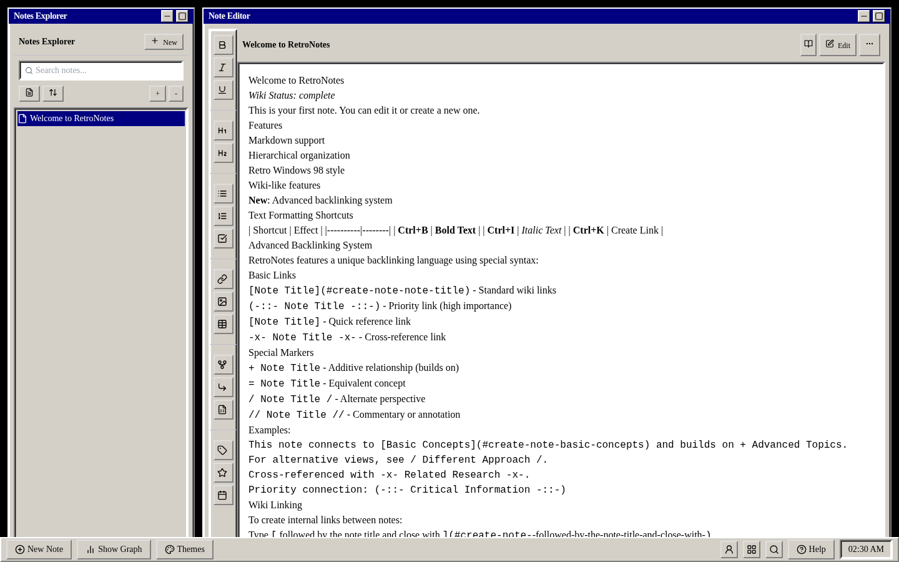

# RetroNotes

A local-first Markdown notebook with hierarchical folders, wiki links, backlinks,
graph visualization, and an unapologetic Windows 98 interface.



## What works today

- **Local browser storage** — notes are saved automatically in `localStorage`;
  there is no account, backend, telemetry, cloud service, or automatic third-party
  font request. Remote Markdown images are blocked in preview.
- **Markdown editor and preview** — headings, emphasis, lists, task lists, code,
  quotes, links, images, and tables.
- **Hierarchical organization** — create notes and folders, nest children, and
  browse them from the Notes Explorer.
- **Wiki links and backlinks** — `[[Note Title]]` links connect notes and feed
  the backlink and graph views.
- **Additional relationship syntax** — priority, cross-reference, additive,
  equivalent, alternate, and commentary links.
- **Interactive graph view** — inspect note relationships using D3.
- **History and wiki metadata** — note status, contributors, versions, and local
  revision snapshots.
- **Retro themes** — Windows 98, terminal, cyberpunk, Y2K, and other bundled
  visual presets.
- **Layouts and utilities** — default, wide, and focus layouts plus search,
  profile, help, sorting, filtering, tags, and favorites.

## Important data note

RetroNotes stores data as plain JSON in the current browser profile under the
`retro-notes-data` local-storage key. It is local-first, but it is **not
encrypted** and does not currently provide sync, import/export, or automatic
backups. Clearing site data or using a private browsing session can remove your
notes.

Do not treat the current version as a secure vault. Export and encryption are
future work.

## Run locally

Requirements:

- Node.js 20.19+ or 22.12+
- npm 10+

```bash
git clone https://github.com/numbpill3d/retro-note-sphere.git
cd retro-note-sphere
npm install
npm run dev
```

Open the local URL printed by Vite (normally `http://localhost:8080`).

## Quality checks

```bash
npm run lint
npm run build
npm audit
```

Run lint and production build together:

```bash
npm run check
```

Run `npm audit` separately to verify the dependency tree.

## Production build

```bash
npm run build
npm run preview
```

The static production output is written to `dist/` and can be hosted on any
static web server. Because note data remains in each browser's local storage,
deploying a new build does not transfer notes between devices or domains.

## Linking syntax

Standard wiki links:

```markdown
[[Basic Concepts]]
```

Additional relationship markers recognized by backlink and graph parsing:

```text
(-::- Critical Information -::-)  priority
-x- Related Research -x-          cross-reference
+ Advanced Topics                 builds on
= Equivalent Concept              equivalent
/ Alternate Perspective /         alternate
// Commentary //                   annotation
```

Links resolve against note titles. Wiki links can create a new page when the
target does not exist.

## Project structure

```text
src/
├── components/
│   ├── GraphView.tsx
│   ├── MarkdownEditor.tsx
│   ├── NoteTree.tsx
│   ├── Taskbar.tsx
│   ├── ThemeSelector.tsx
│   └── notes/ and ui/
├── context/
│   ├── NoteContext.tsx
│   └── ThemeContext.tsx
├── pages/
│   └── Index.tsx
└── main.tsx
```

## Current limitations

- Browser-only; no packaged desktop or mobile application.
- No encryption, authentication, sync, collaboration, plugins, or server-side
  storage.
- No import/export or backup workflow yet.
- Search and some advanced toolbar actions are still basic UI implementations.
- Large notebooks may hit browser local-storage limits.

## Technology

React 18, TypeScript, Vite 8, Tailwind CSS, shadcn/Radix UI, D3,
React Markdown, and browser local storage.

## Credits

Created by [voidrane](https://voidrane.nekoweb.org) and
[numbpilled](https://numbpilled.neocities.org).

## License

MIT — see [LICENSE](LICENSE).
